\# DNS Tunneling Detection Lab using Splunk SIEM


\## Overview

This project demonstrates the simulation and detection of DNS tunneling activity in an isolated SOC lab environment using:


\- Kali Linux

\- Windows DNS Server

\- Splunk SIEM

\- Iodine DNS tunneling tool


The objective was to generate tunneling-style DNS traffic and detect suspicious DNS behavior using Splunk detection queries and visualizations.


\---


\## Lab Architecture


Kali Linux (Attacker)

&#x20;       |

&#x20;       v

Windows DNS Server (Logging)

&#x20;       |

&#x20;       v

Splunk SIEM (Detection \& Analysis)


\---


\## Attack Simulation


\### Simulated DNS Tunneling

Random suspicious DNS queries were generated using:

\- nslookup

\- Iodine


Example:

ajd82js92j.tunnel.lab


\---


\## Detection Techniques


\### Long DNS Query Detection


```spl

source=dns.log

| eval query_length=len(_raw)

| where query_length > 120

| table _time _raw query_length

```


\### DNS Traffic Spike Detection


```spl

source="\*dns\*" 

| timechart span=1m count

```


\### High Entropy Detection


```spl

source=dns.log

| regex _raw="\[A-Za-z0-9]{25,}"

```


\---


\## Tools Used


\- Splunk Enterprise

\- Kali Linux

\- Windows Server DNS

\- Iodine

\- VirtualBox


\---


\## MITRE ATT\&CK Mapping


| Technique | ID |

|---|---|

| DNS Protocol | T1071.004 |


\---


\## Key Learning Outcomes


\- DNS tunneling concepts

\- SIEM log analysis

\- Splunk detection engineering

\- DNS anomaly detection

\- SOC monitoring workflow

\- Blue team analysis


\---

## Lab Setup

### Network Configuration
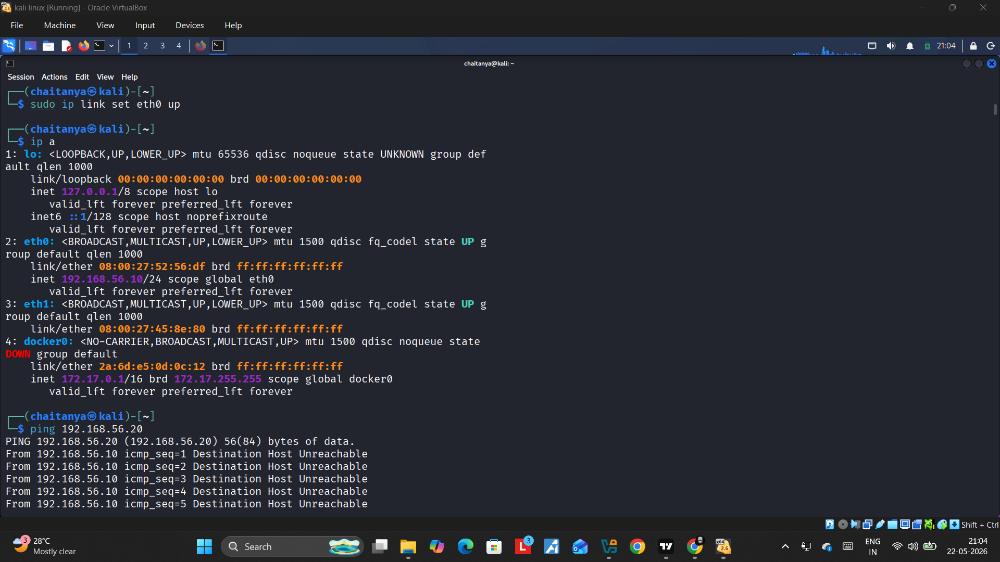
*Kali Linux attacker machine IP configuration*

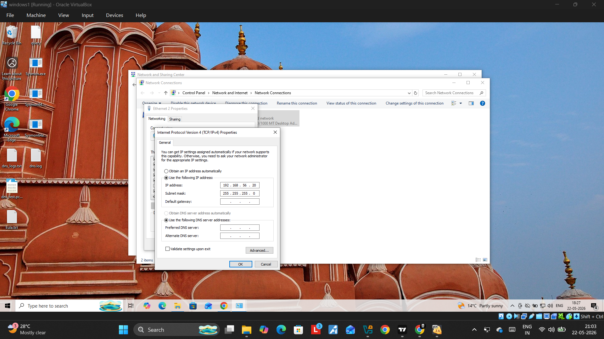
*Windows client IP configuration*

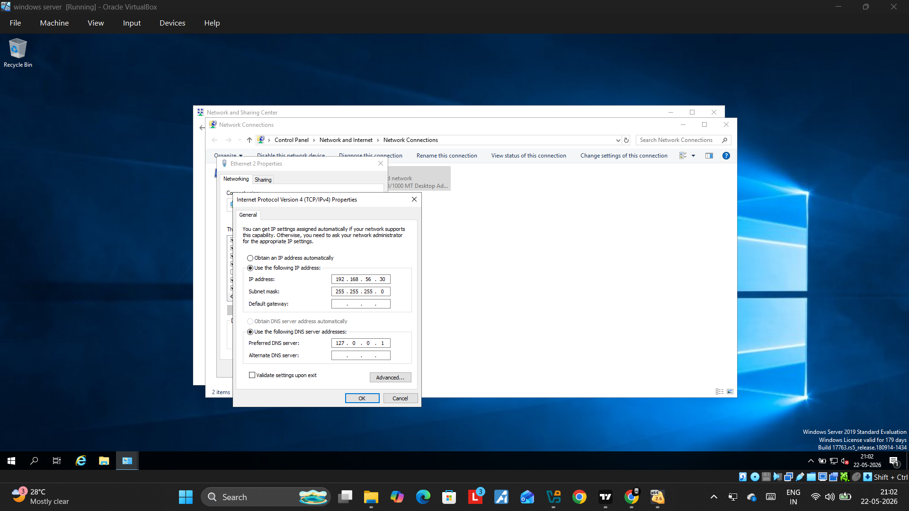
*Windows Server (DNS server) IP configuration*

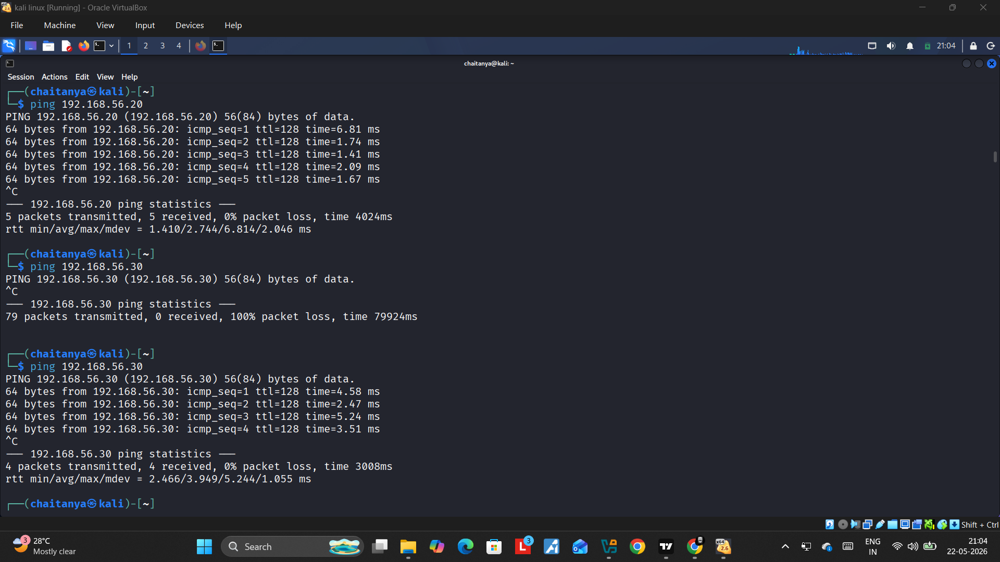
*Verifying connectivity between attacker and victim VMs before starting the simulation*

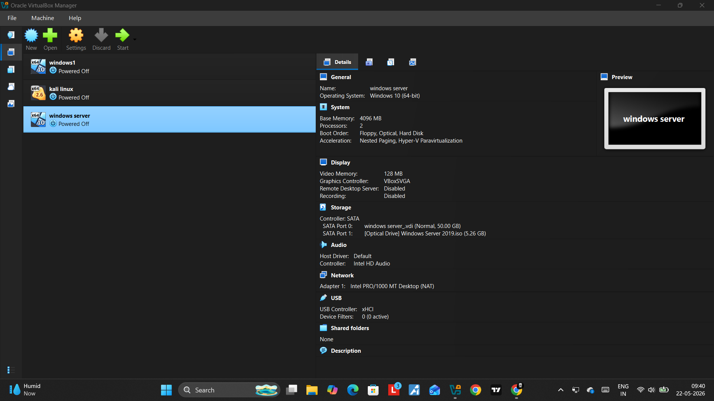
*Overall isolated lab environment used for the simulation*

---

## Attack Simulation

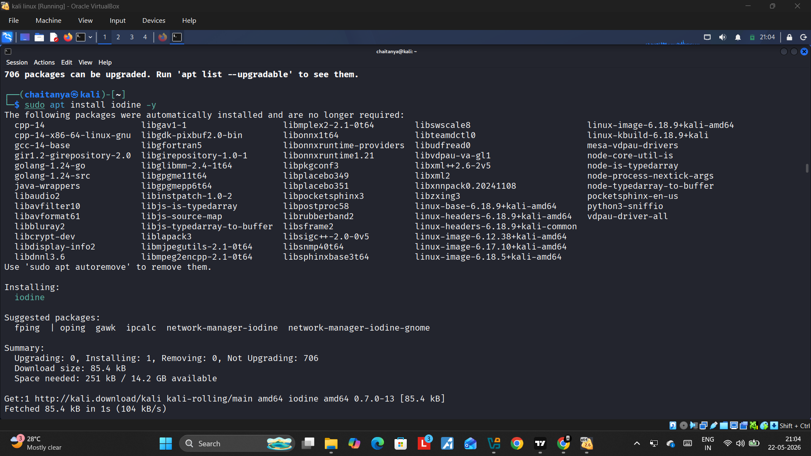
*Installing Iodine DNS tunneling tool on Kali Linux*

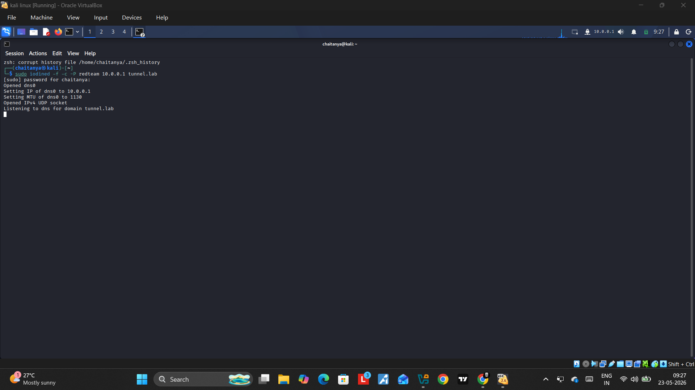
*Starting the Iodine DNS tunnel listener on the server side*

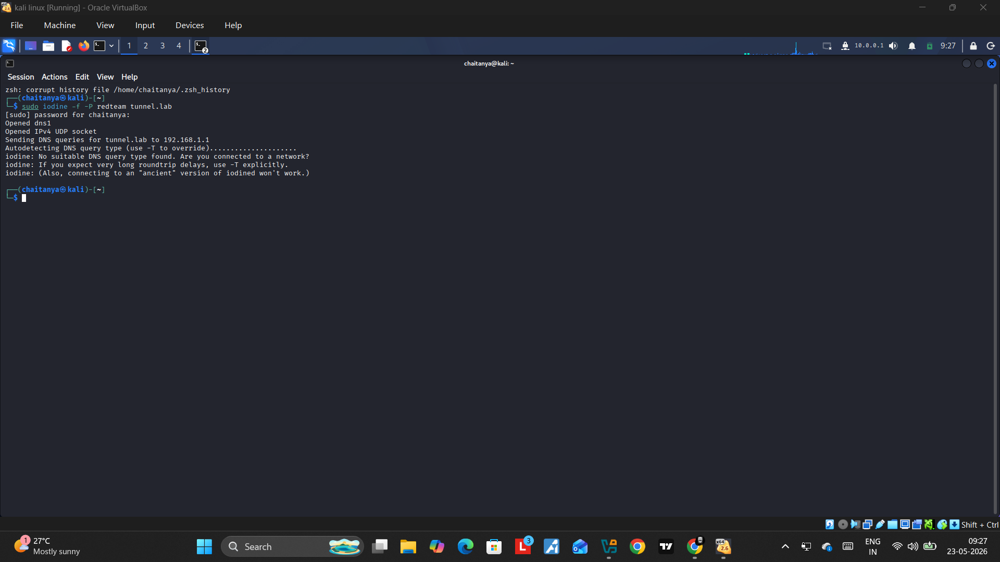
*Generating tunneling-style DNS queries from the attacker machine*

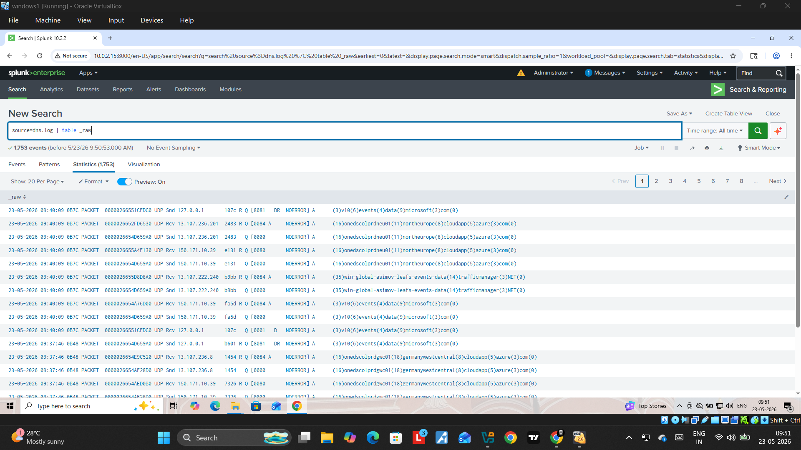
*DNS debug logging enabled on Windows DNS Server to capture tunneling traffic*

---

## Log Ingestion into Splunk

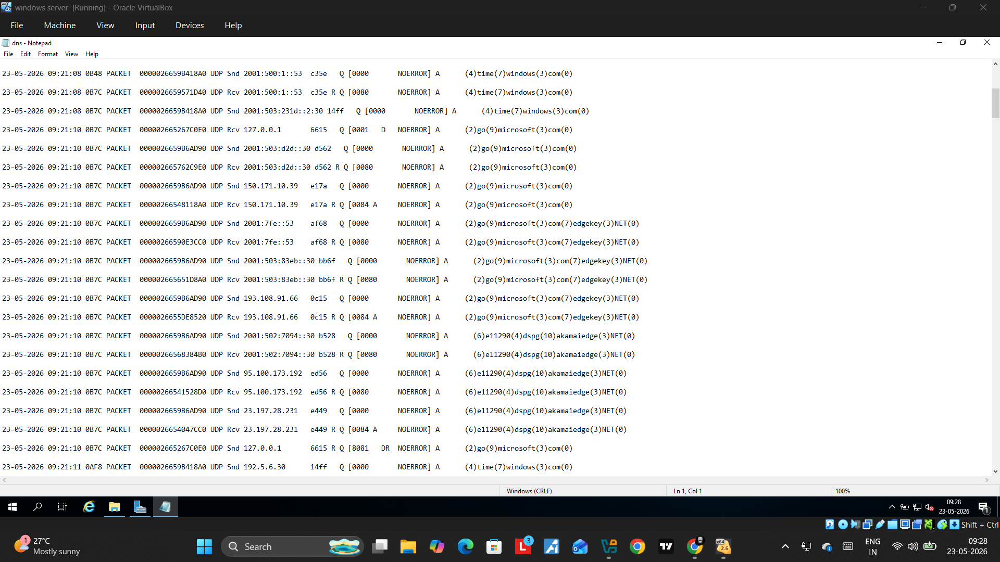
*Raw DNS logs generated on the Windows DNS Server*

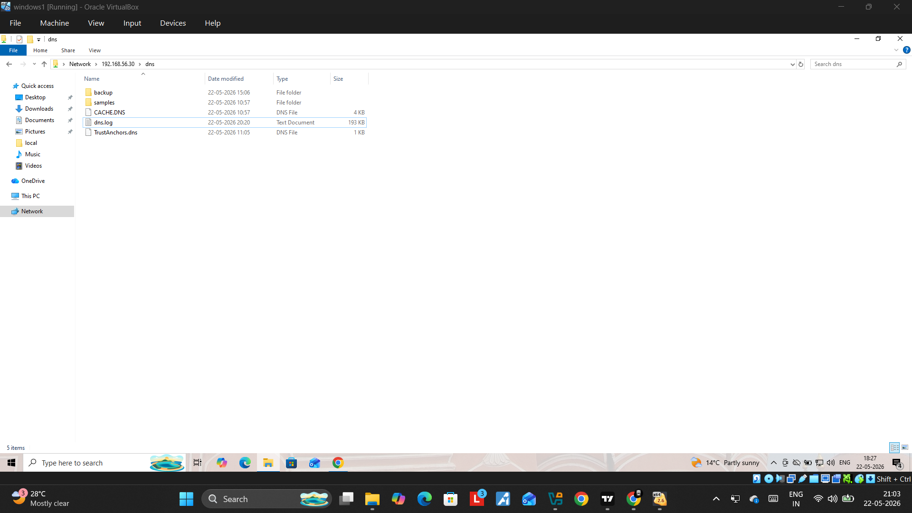
*DNS log file before ingestion*

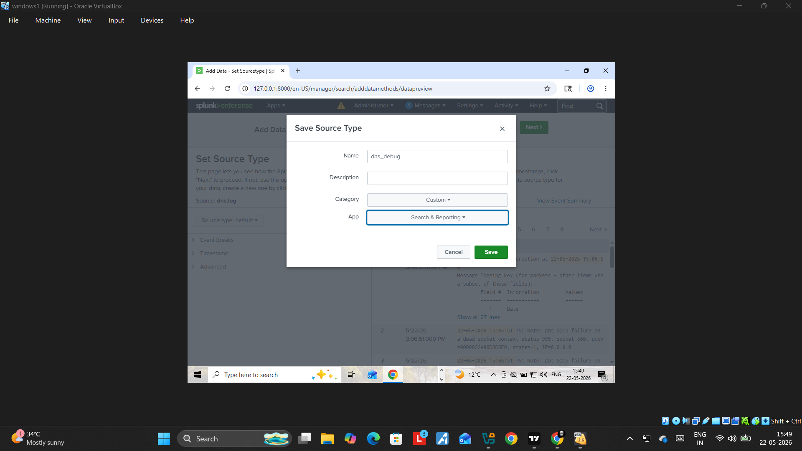
*Ingesting DNS logs into Splunk for analysis*

---

## Detection Results

### Long DNS Query Detection

\`\`\`
source=dns.log
| eval query_length=len(_raw)
| where query_length > 120
| table _time _raw query_length
\`\`\`

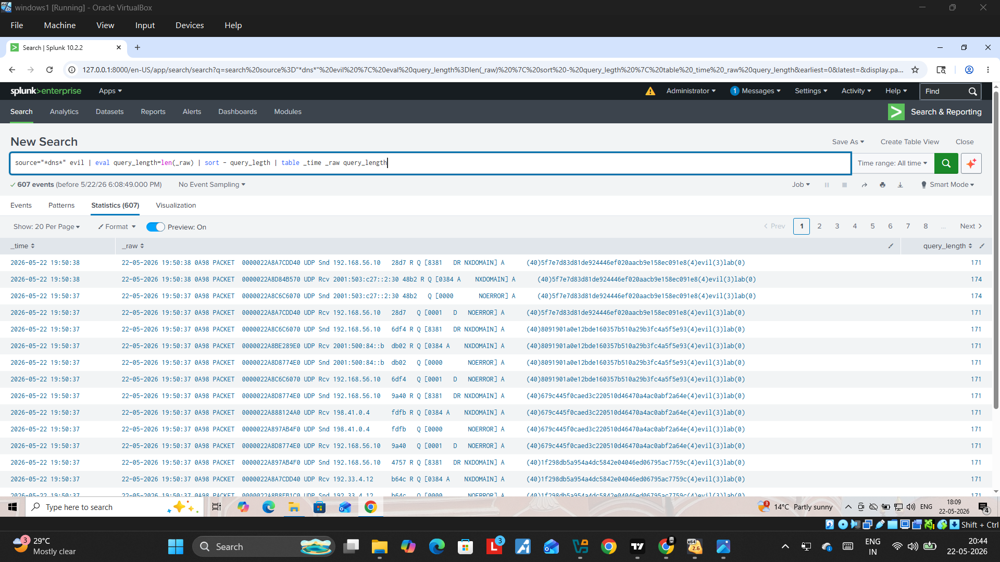
*Query results showing DNS requests with abnormally long query lengths, indicative of tunneling*

### DNS Traffic Spike Detection (Timechart)

\`\`\`
source="*dns*"
| timechart span=1m count
\`\`\`

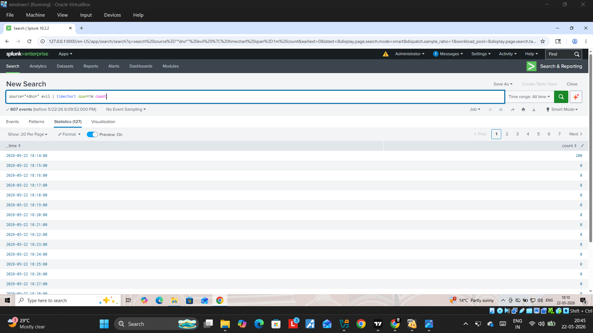
*Spike in DNS query volume during the simulated tunneling session*

### Tunneling Events Summary

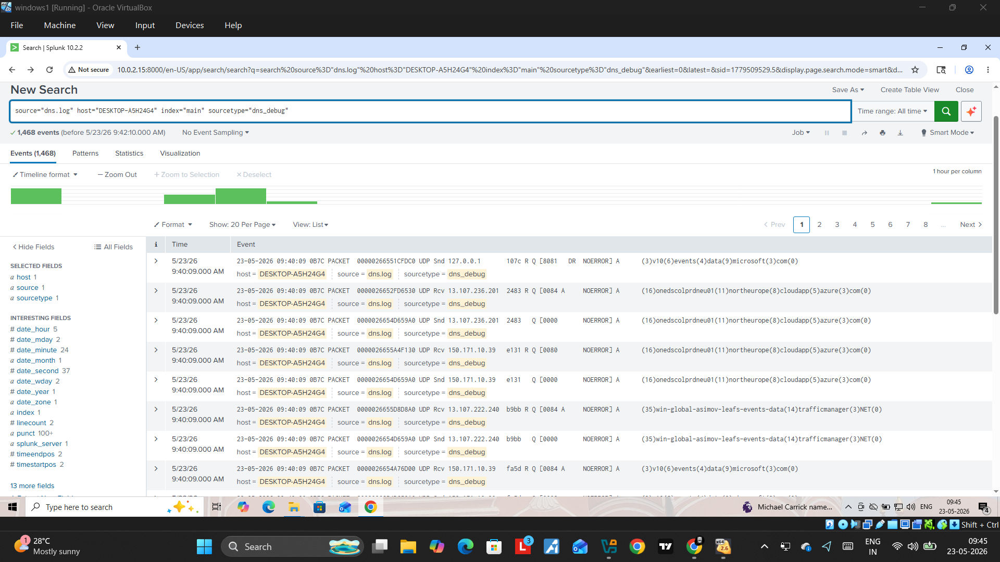
*Correlated view of DNS tunneling-related events in Splunk*

---

## Final Dashboard

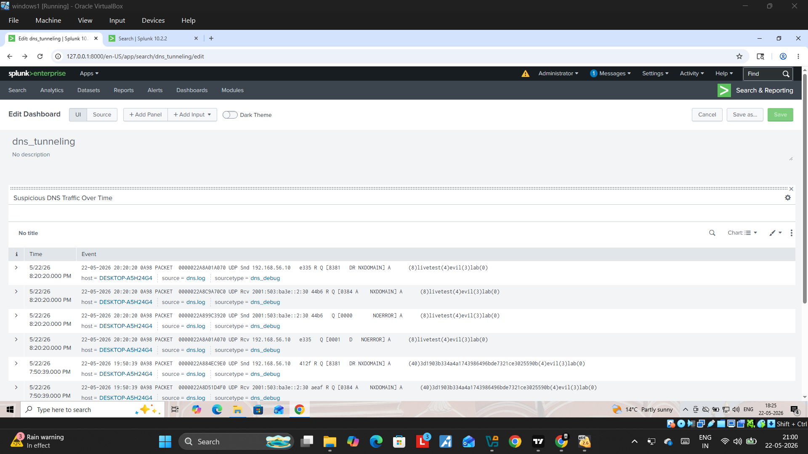
*Consolidated Splunk dashboard combining all detection panels for monitoring DNS tunneling activity*


